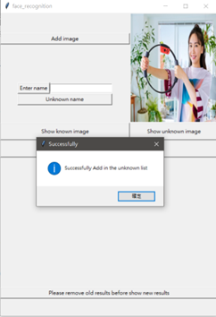

# numerical_final_project

## 一 摘要
圖像辨識在機器學習中是蠻熱門的議題，透過分析圖片的組成和相關的特徵，能夠將相似的圖片分類在一起，能夠節省大量的時間和降低錯誤率，甚至能夠再延伸到影像辨識上面。透過此次專題實作，能夠運用的原理。
## 二 研究動機與研究問題
在現今許多的收尋引擎和瀏覽器，例如Google, Firefox, Edge等，不僅僅能透過文字收尋，更能夠透過照片去收尋相關的內容；亦或是個人手機電腦相簿中，會將相似的照片做分類，或是提供建議(刪除或保留)，這些都有應用到圖片辨識的基礎。

OpenCV(Open Source Computer Vision Library)，是一個開源的跨平台的電腦視覺庫，裡面有需多能夠使用的現成套件，如人臉辨識、貓臉辨識、全身辨識等，能夠幫助減少開發的時間。此次專題實作人臉辨識，進行初步的圖片處理認知，了解自動相簿分類的背後原理。
## 三 研究方法及步驟
一般的圖片格式為JPG, JPEG，但在圖像辨識基礎上，必須先將圖片轉換為RGB的格式(矩陣[RED,GREEN, BLUE])，使照片為三種不同顏色的圖層疊加而成的。再透過使用OpenCV中的haarcascade_frontalface_default.xml，以及使用python 中的face_recognition 作為人臉辨識使用的套件，計算出未知圖片與已知圖片的歐式距離差；如果數值越小，即愈相似，所以自訂一個門檻值，做為比較依據，當數值小於門檻值時，便認定兩人為同一人，反之為不一樣，或是未知。最後透過python 內建的tkinter 作為GUI的使用介面，顯示輸出結果。
預計實現的功能如下

A.	自由添加圖片到已知人臉的資料庫，並輸入其對應的名字

B.	自由添加圖片到未知人臉的資料庫(要辨識的)

C.	展示已知資料庫中有誰的資料

D.	展示未知要辨識的照片有哪些

E.	已知資料與未知資料做比對，顯示出比對的結果

## 四 成果與討論
按鈕的功能

Add image:選擇添加照片(預設D槽)

Show known image:顯示已知圖庫
(有預設照片2張)

Show unknown image:顯示未知圖庫                
(有預設照片3張)

Comparation: 比對已知與未知圖庫

Please-remove-old-results-before-show new-results:顯示新的動作結果時，先移除舊的結果

添加照片到已知資料庫    

  

顯示已知資料庫

添加照片到未知資料庫

顯示未知資料庫

比對已知與未知資料庫

顯示新的輸出內容時，先清除原有的內容 

在此次設計，僅僅使用一張圖做為一個人的資料庫，所以在分辨上容易造成誤判，所以非常仰賴自訂義的門檻值作為篩選，但調低門檻值時，卻會造成原先能辨別的圖片，變成辨識不出來。由此可知，單張圖片的人臉特徵值不夠強，無法準確的分辨出不同的人臉，所以應該增加相同人臉的資料庫，增加其特徵的強度，才能達到更好、更精準的分辨。
對於此次專題的未來發展，在完成資料庫的強化後，因為圖片是靜態，所以希望朝影像識別、動態的方向作為延伸，達到更即時、使用層面更廣的方向前進。

